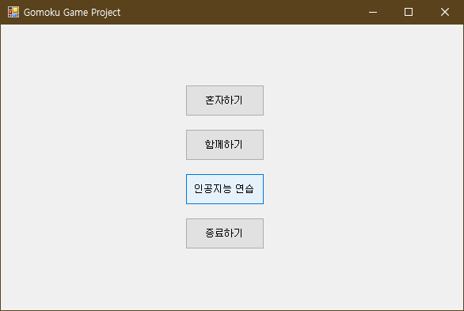
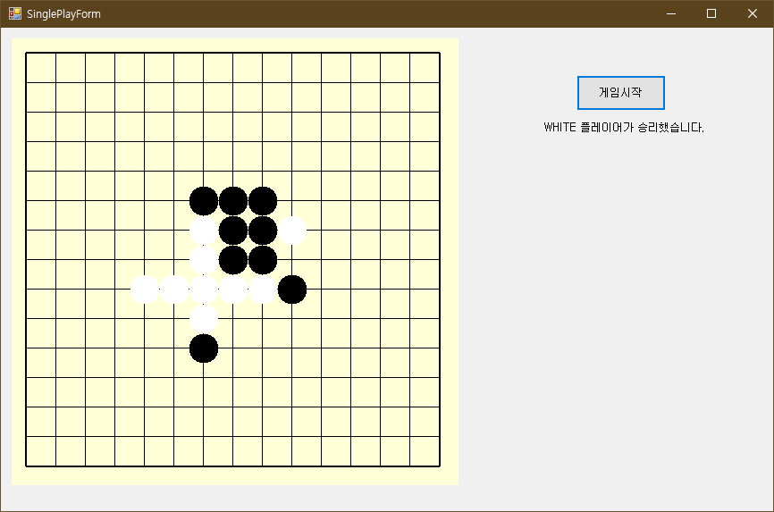
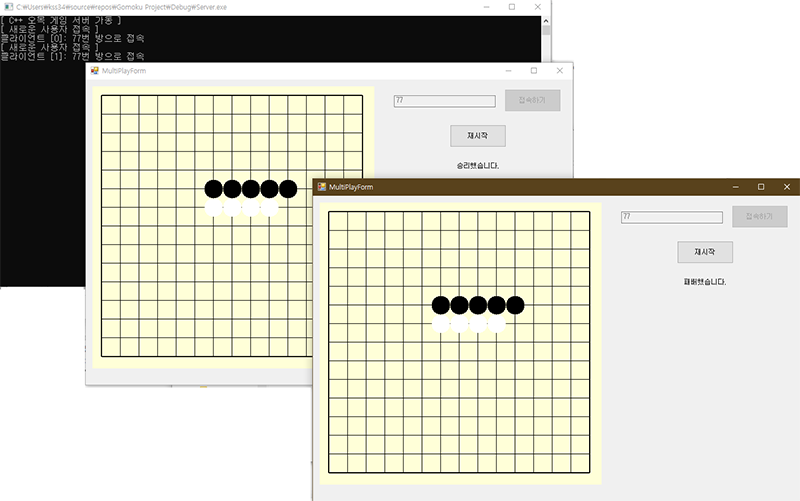
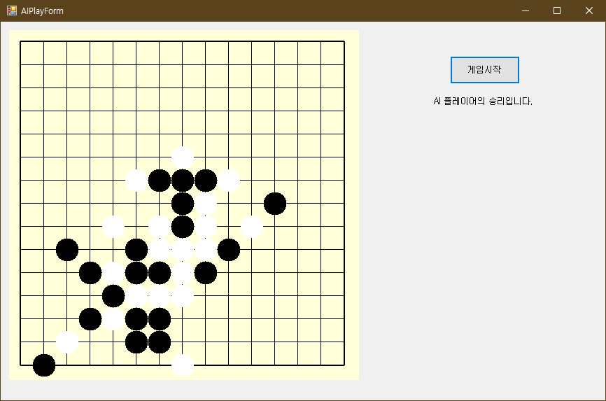

# CPP_Gomoku-Game-Project
[2020-08-01 ~ 2020-08-09] Gomoku Game Project with C++ and C#

### 프로그램 개발 환경
- OS : Microsoft Windows 10
- IDE : Microsoft Visual Studio 2019 16.4

### 기능 설명
- 혼자 하기 기능 구현
- 함께 하기 기능 구현 (서버를 이용한 멀티 플레이)
- 인공지능 연습 기능 구현 (Alpha-Beta Prunning 알고리즘 적용)

### 프로그램 실행 방법
- Gomoku Project\Debug 디렉터리에 있는 `Server.exe` 프로그램 실행
- Gomoku Project\Client\bin\Release(or Release) 디렉터리에 있는 `Client.exe` 프로그램 실행

### 실행 화면

> 메뉴 화면

> 혼자하기 화면

> 함께하기 화면

> 인공지능 연습 화면

